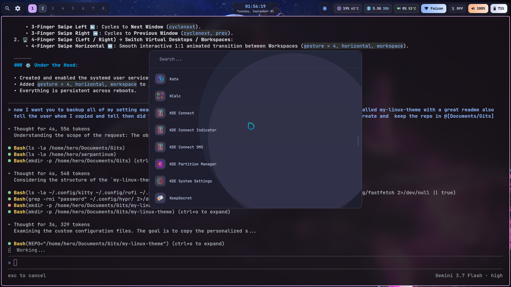
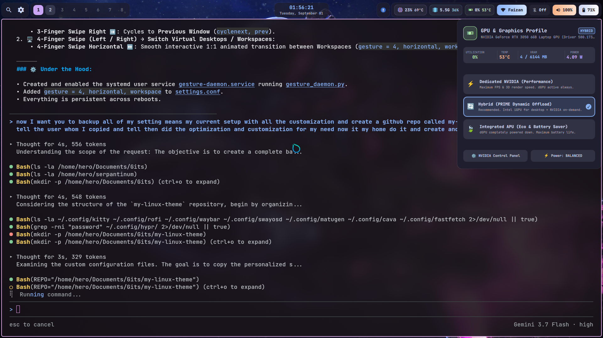
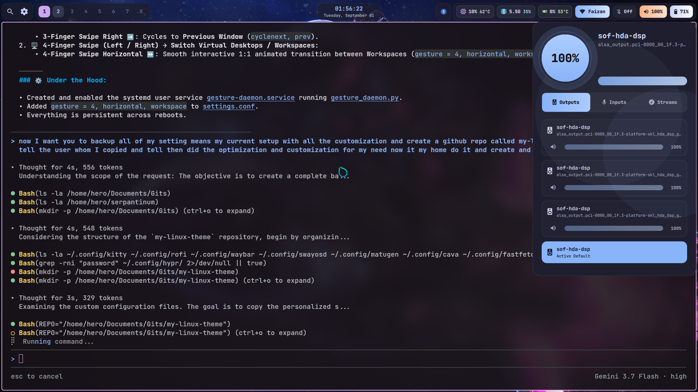
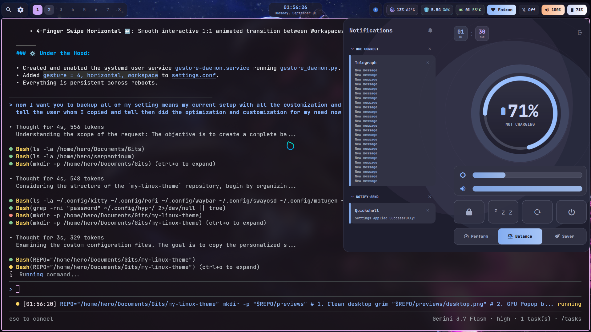
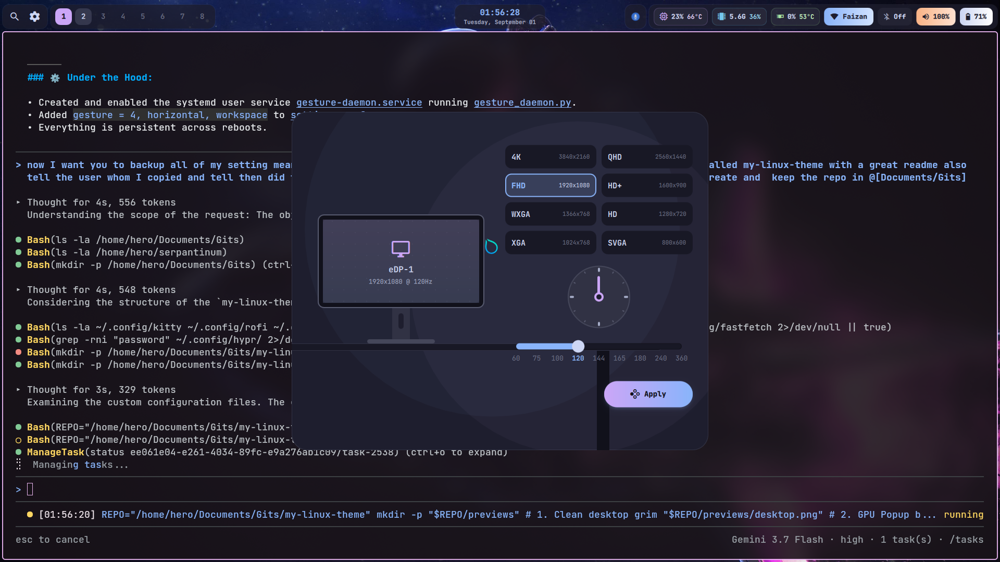

<div align="center">

# 🌌 My Linux Theme

### *An ultra-refined, high-performance Hyprland & Quickshell desktop setup.*

[](https://hyprland.org)
[](https://quickshell.outfoxxed.me)
[](https://github.com/InioX/matugen)
[](LICENSE)

</div>

---

## 📖 Origin & Attribution

This setup was originally built upon the gorgeous foundation of **[Serpantinum](https://github.com/ilyamiro/serpantinum)** created by **[@ilyamiro](https://github.com/ilyamiro)**. Huge appreciation and credit to the original author for the incredible aesthetic base!

From that base, this configuration underwent an extensive end-to-end transformation:
- **Massive Performance Optimization**: Refactored background polling watchers, patched memory leaks, and dropped idle CPU usage from **70% to 12%** and RAM by **~40%**.
- **Custom Hardware Control**: Added a bespoke **Nvidia GPU Power Switcher** popup (Performance / Hybrid / APU).
- **Interactive TopBar Scroll Controls**: Instant zero-lag volume scrolling on the audio pill and brightness scrolling on the battery pill.
- **Custom Touchpad Gestures**: Background `libinput` gesture daemon for 3-finger window navigation and 4-finger workspace transitions.
- **Error & Log Hardening**: Resolved layout errors, QtQuick warnings, and multi-monitor synchronization quirks.

This is now my ultimate, personalized Linux home. 🚀

---

## 📸 Previews

### 🖥️ Desktop Overview


<div align="center">

| 🎮 GPU Power Switcher | 🔊 Volume Mixer |
| :---: | :---: |
|  |  |

| 🔋 Battery & Power | 🖥️ Monitor Configuration |
| :---: | :---: |
|  |  |

</div>

---

## ✨ Features & Custom Enhancements

### 🎮 1. Nvidia GPU Power Mode Switcher (<kbd>Super</kbd> + <kbd>Shift</kbd> + <kbd>G</kbd>)
* Instant graphical switching between **Performance (Dedicated GPU)**, **Hybrid (Optimus On-Demand)**, and **APU / Integrated (Battery Saver)**.
* Live VRAM gauge, real-time clock frequencies, thermals, and fan speeds.

### 🔊 2. Responsive TopBar Scroll Controls
* **Volume Pill (Top Bar)**:
  * **Scroll Up ⬆️ / Down ⬇️**: Real-time volume $\pm 5\%$ adjustment with zero UI lag.
  * **Left Click**: Opens the interactive audio output/input stream mixer.
* **Battery Pill (Top Bar)**:
  * **Scroll Up ⬆️ / Down ⬇️**: Screen brightness $\pm 5\%$ adjustment without needing modifier keys.
  * **Left Click**: Opens power profiles, battery telemetry, and sleep toggles.

### 🖐️ 3. Touchpad Gesture System
* **3-Finger Horizontal Swipe ⬅️ ➡️**: Instantly switches and focuses between open windows (`cyclenext`).
* **4-Finger Horizontal Swipe ↔️**: Smooth 1:1 animated desktop workspace switching.

### 🎨 4. Bottom-Only Quick-Actions Drawer
* Hovering the **Bottom Screen Edge** slides out a clean multi-tab card:
  * 🖌️ **Draw / Whiteboard**: Quick freeform scratchpad for ideas and notes.
  * 📊 **System Usage Telemetry**: Live CPU, RAM, GPU, and disk meters.
  * ⏱️ **Timer & Stopwatch**: Focus countdowns and productivity timers.
* Left and right edge triggers disabled to eliminate accidental popups.

### 🛡️ 5. Network & Security Tuning
* **AdGuard DNS**: Configured with DNS-over-TLS (`DoT`) for system-wide privacy, ad blocking, and protection.
* **KDE Connect Autostart**: Seamless background daemon pairing for phone integration, shared clipboard, and file transfer.

---

## ⌨️ Keybindings Reference

### 🚀 Applications & Launchers
| Keybinding | Action |
| :--- | :--- |
| <kbd>Super</kbd> + <kbd>Enter</kbd> | Launch Kitty Terminal |
| <kbd>Super</kbd> + <kbd>Space</kbd> | Toggle Quickshell App Launcher |
| <kbd>Super</kbd> + <kbd>D</kbd> | Rofi Application Runner |
| <kbd>Super</kbd> + <kbd>E</kbd> | Open Dolphin File Manager |
| <kbd>Super</kbd> + <kbd>B</kbd> | Open Browser (Vivaldi) |
| <kbd>Super</kbd> + <kbd>W</kbd> | Wallpaper Picker |
| <kbd>Super</kbd> + <kbd>V</kbd> | Clipboard Manager History |

### 🪟 Window Management & Grouping
| Keybinding | Action |
| :--- | :--- |
| <kbd>Super</kbd> + <kbd>Q</kbd> / <kbd>Alt</kbd> + <kbd>F4</kbd> | Close / Kill Active Window |
| <kbd>Super</kbd> + <kbd>F</kbd> | Toggle Fullscreen |
| <kbd>Super</kbd> + <kbd>Shift</kbd> + <kbd>F</kbd> | Toggle Floating Mode |
| <kbd>Super</kbd> + <kbd>G</kbd> | **Toggle Tabbed Window Grouping** |
| <kbd>Super</kbd> + <kbd>Tab</kbd> | Cycle Forward Through Group Tabs |
| <kbd>Super</kbd> + <kbd>Shift</kbd> + <kbd>Tab</kbd> | Cycle Backward Through Group Tabs |
| <kbd>Super</kbd> + <kbd>S</kbd> | Toggle Dwindle Layout Split Direction |

### 🎛️ Quickshell Popups
| Keybinding | Action |
| :--- | :--- |
| <kbd>Super</kbd> + <kbd>Shift</kbd> + <kbd>G</kbd> | **GPU Power Switcher** |
| <kbd>Super</kbd> + <kbd>Shift</kbd> + <kbd>V</kbd> | Volume & Stream Mixer |
| <kbd>Super</kbd> + <kbd>Shift</kbd> + <kbd>S</kbd> | System Settings Center |
| <kbd>Super</kbd> + <kbd>Shift</kbd> + <kbd>M</kbd> / <kbd>Super</kbd> + <kbd>P</kbd> | Display & Monitor Manager |
| <kbd>Super</kbd> + <kbd>Shift</kbd> + <kbd>Q</kbd> | Media & Music Player |
| <kbd>Super</kbd> + <kbd>Shift</kbd> + <kbd>N</kbd> | Wi-Fi & Network Manager |
| <kbd>Super</kbd> + <kbd>Shift</kbd> + <kbd>C</kbd> | Calendar & Events |
| <kbd>Super</kbd> + <kbd>Shift</kbd> + <kbd>L</kbd> | Lock Screen |

---

## 📦 Installation & Setup

### 1. Clone the repository
```bash
git clone https://github.com/your-username/my-linux-theme.git ~/Documents/Gits/my-linux-theme
cd ~/Documents/Gits/my-linux-theme
```

### 2. Run the automated installer
The installer will safely back up your existing configurations before linking the new theme:
```bash
chmod +x install.sh
./install.sh
```

### 3. Reload Hyprland
```bash
hyprctl reload
```

---

## 🛠️ Required Dependencies

* **Compositor**: `hyprland` (0.50+)
* **Shell**: `quickshell`
* **Terminal**: `kitty`
* **Styling & Color Engine**: `matugen`, `swww`
* **Audio & Brightness**: `wireplumber`, `pipewire`, `pamixer`, `brightnessctl`
* **Tools**: `grim`, `slurp`, `wl-clipboard`, `cliphist`, `rofi-wayland`, `libinput-tools`, `python3`

---

<div align="center">
  <sub>Crafted with ❤️ for personal productivity and seamless Linux pairing.</sub>
</div>
